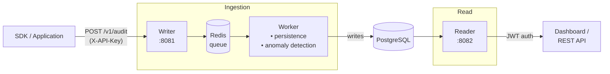

# BatAudit

> Lightweight, self-hosted audit logging platform — collect, store, query, and get anomaly alerts for events from any application.

---

## What is BatAudit?

BatAudit is a self-hosted auditing solution built in Go with a React dashboard. Any application (regardless of language) sends HTTP events to the Writer; they are validated, sanitized, queued in Redis, persisted to PostgreSQL by the Worker, and instantly visible in the dashboard served by the Reader.

The Worker also runs a statistical anomaly detection engine — no external ML models, no cloud dependencies. Everything stays on your infrastructure.



---

## Services

| Service | Port | Responsibility |
|---------|------|----------------|
| Writer  | 8081 | Receives events from SDKs (API Key auth), sanitizes, enqueues to Redis |
| Worker  | —    | Consumes Redis queue, persists to PostgreSQL, runs anomaly detection |
| Reader  | 8082 | Serves dashboard + REST API (JWT auth) + Swagger UI |

---

## Quick Demo

Try BatAudit locally in one command — no configuration needed.

```bash
docker compose -f docker-compose.demo.yml up
```

The stack starts, runs database migrations, seeds ~3 000 realistic audit events, and creates a demo account automatically.

| | |
|---|---|
| **Dashboard** | http://localhost:8082/app |
| **Login** | `demo@bataudit.dev` / `demo` |
| **Writer API** | http://localhost:8081 |
| **Swagger UI** | http://localhost:8082/docs/index.html |

To stop and remove all demo data:

```bash
docker compose -f docker-compose.demo.yml down -v
```

---

## Running

### Prerequisites

- Docker + Docker Compose
- Go 1.24+
- Node.js 20+ with pnpm (frontend only)

### Infrastructure only (Postgres + Redis)

```bash
docker compose up -d
```

### Full stack in Docker

```bash
docker compose -f docker-compose.services.yml up -d
```

### Locally (backend)

```bash
# Writer (port 8081)
DB_HOST=localhost DB_USER=batuser DB_PASSWORD=batpassword DB_NAME=batdb \
  REDIS_ADDRESS=localhost:6379 \
  go run ./cmd/api/writer

# Worker
DB_HOST=localhost DB_USER=batuser DB_PASSWORD=batpassword DB_NAME=batdb \
  REDIS_ADDRESS=localhost:6379 \
  go run ./cmd/api/worker

# Reader (port 8082)
JWT_SECRET=change-me \
  DB_HOST=localhost DB_USER=batuser DB_PASSWORD=batpassword DB_NAME=batdb \
  go run ./cmd/api/reader
```

### Frontend

```bash
cd frontend
pnpm install
VITE_API_URL=http://localhost:8082 pnpm dev   # dev server at http://localhost:5173
pnpm build                                     # production build → dist/
```

### Seed (development data)

```bash
# Populates the database with ~3000 realistic audit events over 30 days
DB_HOST=localhost DB_USER=batuser DB_PASSWORD=batpassword DB_NAME=batdb \
  go run scripts/seed.go
```

---

## Initial setup

Set env vars to create the first owner account on startup:

```bash
INITIAL_OWNER_EMAIL=admin@example.com
INITIAL_OWNER_PASSWORD=changeme
INITIAL_OWNER_NAME=Admin
```

Or use the setup wizard on first access at `http://localhost:8082/app`.

---

## Environment variables

### Writer

| Variable         | Default                  | Description                    |
|------------------|--------------------------|--------------------------------|
| `DB_HOST`        | `localhost`              | PostgreSQL host                |
| `DB_PORT`        | `5432`                   | PostgreSQL port                |
| `DB_USER`        | `batuser`                | PostgreSQL user                |
| `DB_PASSWORD`    | `batpassword`            | PostgreSQL password            |
| `DB_NAME`        | `batdb`                  | PostgreSQL database name       |
| `REDIS_ADDRESS`  | `localhost:6379`         | Redis address                  |
| `JWT_SECRET`     | `change-me-in-production`| JWT signing secret             |
| `API_WRITER_PORT`| `8081`                   | HTTP port                      |
| `LOG_LEVEL`      | `info`                   | Log level: debug/info/warn/error|

### Worker

| Variable              | Default         | Description                               |
|-----------------------|-----------------|-------------------------------------------|
| `DB_*` / `REDIS_*`    | (same as Writer)| Database and Redis connection             |
| `WORKER_COUNT`        | `2`             | Initial worker goroutines                 |
| `MAX_WORKERS`         | `10`            | Maximum worker goroutines (autoscaling)   |
| `ENABLE_AUTOSCALING`  | `true`          | Enable/disable queue-based autoscaling    |
| `SCALE_UP_THRESHOLD`  | `15`            | Queue depth that triggers scale-up        |
| `LOG_LEVEL`           | `info`          | Log level                                 |

### Reader

| Variable                 | Default                  | Description                    |
|--------------------------|--------------------------|--------------------------------|
| `DB_*`                   | (same as Writer)         | Database connection            |
| `JWT_SECRET`             | `change-me-in-production`| JWT signing secret (must match Writer) |
| `API_READER_PORT`        | `8082`                   | HTTP port                      |
| `INITIAL_OWNER_EMAIL`    | —                        | Creates owner on first startup |
| `INITIAL_OWNER_PASSWORD` | —                        | Owner password                 |
| `INITIAL_OWNER_NAME`     | `Admin`                  | Owner display name             |
| `LOG_LEVEL`              | `info`                   | Log level                      |

---

## API

All routes are prefixed with `/v1`. The API is versioned — breaking changes will increment the version prefix (e.g. `/v2`). The version is part of the URL path, not a header or query param. SDKs should always include the version prefix so they keep working even after a new version is released.

> **Stability guarantee:** within a major version, endpoints are additive-only. New fields may appear in responses but existing fields will not be removed or renamed.

| Auth method | Used by | Header |
|-------------|---------|--------|
| API Key     | Writer  | `X-API-Key: <key>` |
| JWT Bearer  | Reader  | `Authorization: Bearer <token>` |

### Writer endpoints

| Method | Path        | Description                                   |
|--------|-------------|-----------------------------------------------|
| POST   | `/v1/audit` | Ingest audit event (requires `X-API-Key`)    |

### Reader endpoints

| Method | Path                     | Description                               |
|--------|--------------------------|-------------------------------------------|
| GET    | `/v1/audit`                          | List events (paginated, filterable)                     |
| GET    | `/v1/audit/export`                   | Download events as CSV or JSON (same filters as list)   |
| GET    | `/v1/audit/:id`                      | Get full event details                                  |
| GET    | `/v1/audit/stats`                    | Aggregated metrics (totals, p95, timeline)              |
| GET    | `/v1/audit/stats/history`            | Time-series from raw events + tiered summaries          |
| GET    | `/v1/audit/stats/usage`              | Storage usage per tier (raw / hourly / daily)           |
| GET    | `/v1/audit/sessions`                 | Derived user sessions (30-min inactivity gap)           |
| GET    | `/v1/audit/sessions/:session_id`     | Events for an explicit session_id (opt-in SDK field)    |
| GET    | `/v1/audit/orphans`                  | Browser events with no matching backend counterpart     |
| GET    | `/v1/anomaly/rules`                  | List anomaly detection rules for a project              |
| POST   | `/v1/anomaly/rules`                  | Create/update an anomaly rule                           |
| DELETE | `/v1/anomaly/rules/:id`              | Deactivate an anomaly rule                              |
| GET    | `/v1/notifications/vapid-public-key` | VAPID public key for Web Push subscriptions             |
| POST   | `/v1/notifications/push/subscribe`   | Register a browser push subscription                    |
| DELETE | `/v1/notifications/push/subscribe`   | Remove a browser push subscription                      |
| GET    | `/v1/notifications/webhooks`         | List configured webhooks                                |
| POST   | `/v1/notifications/webhooks`         | Register a webhook URL                                  |
| DELETE | `/v1/notifications/webhooks/:id`     | Remove a webhook                                        |
| POST   | `/v1/notifications/webhooks/:id/test`| Send a test payload to a webhook                        |
| GET    | `/v1/notifications/deliveries`       | Delivery history (last 50 per webhook)                  |
| POST   | `/v1/auth/login`                     | Login (returns JWT)                                     |
| POST   | `/v1/auth/logout`                    | Invalidate token                                        |
| GET    | `/v1/auth/me`                        | Current user info                                       |

Interactive docs: `http://localhost:8082/docs/index.html` (Swagger UI)

### Audit event filters (`GET /v1/audit`)

| Param         | Type   | Description                                  |
|---------------|--------|----------------------------------------------|
| `project_id`  | string | Filter by project                            |
| `service_name`| string | Filter by service                            |
| `identifier`  | string | Filter by user/client                        |
| `method`      | string | GET / POST / PUT / DELETE                    |
| `status_code` | int    | Exact HTTP status code                       |
| `environment` | string | production / staging / development / testing |
| `event_type`  | string | `http` (default) or `system.alert`           |
| `start_date`  | ISO 8601| Filter from date                            |
| `end_date`    | ISO 8601| Filter to date                              |
| `sort_by`     | string | timestamp / status_code / response_time      |
| `sort_order`  | string | asc / desc                                   |
| `page`        | int    | Page number (default: 1)                     |
| `limit`       | int    | Items per page (default: 10)                 |

---

## Anomaly Detection

The Worker continuously analyzes incoming events using statistical methods. When an anomaly is detected, a `system.alert` event is written to the audit log and appears in the dashboard.

### Detection rules

| Rule type       | Trigger                                                     | Default threshold |
|-----------------|-------------------------------------------------------------|-------------------|
| `volume_spike`  | Events/min > historical mean + N×σ (z-score)               | 3σ                |
| `error_rate`    | 4xx+5xx rate in 5-min window exceeds threshold              | 20%               |
| `brute_force`   | Same identifier with N auth failures (401/403) in window   | 10 attempts       |
| `silent_service`| No events from project for longer than threshold           | 15 minutes        |
| `mass_delete`   | More than N DELETE requests in window                       | 50 requests       |

Rules are created automatically for each new project and can be customized via the API.

### Alert cooldown

Each `(project, rule_type)` pair is rate-limited to one alert every 5 minutes to prevent notification spam.

---

## Project structure

```
bataudit/
├── cmd/
│   └── api/
│       ├── writer/       # Writer service entrypoint
│       ├── reader/       # Reader service entrypoint
│       └── worker/       # Worker service entrypoint
├── internal/
│   ├── audit/            # Core domain: model, repository, service, handler
│   │   ├── sanitizer.go  # XSS + sensitive data detection and masking
│   │   └── validator.go  # Custom field validators (IP, UUID, env, ...)
│   ├── anomaly/          # Anomaly detection engine + rules API
│   │   ├── detector.go   # Sliding-window detectors (z-score, rate, brute-force, ...)
│   │   ├── handler.go    # HTTP handlers for rules CRUD
│   │   ├── model.go      # AnomalyRule struct + default rules
│   │   └── repository.go # GORM data access for anomaly_rules
│   ├── auth/             # Auth domain: JWT, API keys, users, projects, members
│   ├── db/               # Database init + migrations
│   ├── queue/            # Redis queue abstraction
│   ├── worker/           # Queue consumer + autoscaler
│   ├── health/           # Health check endpoint
│   └── config/           # Env var helpers
├── docs/                 # Auto-generated Swagger (swaggo/swag)
├── frontend/             # React 19 + TypeScript + Vite dashboard
│   └── src/
│       ├── routes/app/   # Dashboard, Sessions, Anomalies pages
│       ├── components/   # Sidebar, Header, ThemeToggle, ...
│       └── queries/      # TanStack Query hooks
├── scripts/
│   └── seed.go           # Development data seed (~3000 events over 30 days)
├── sdks/
│   ├── node/             # @bataudit/node — Express, Fastify, Lambda
│   └── browser/          # @bataudit/browser — fetch/XHR interceptors
└── docker-compose*.yml
```

---

## SDKs

### Node.js (`@bataudit/node`)

```bash
npm install @bataudit/node
```

**Express:**
```typescript
import { createExpressMiddleware } from '@bataudit/node'
app.use(createExpressMiddleware({ apiKey: 'bat_...', serviceName: 'my-api', writerUrl: 'http://localhost:8081' }))
```

**Fastify:**
```typescript
import { applyBatAuditPlugin } from '@bataudit/node'
applyBatAuditPlugin(fastify, { apiKey: 'bat_...', serviceName: 'my-api', writerUrl: 'http://localhost:8081' })
```

**AWS Lambda:**
```typescript
import { createLambdaWrapper } from '@bataudit/node'
const bataudit = createLambdaWrapper({ apiKey: 'bat_...', serviceName: 'my-lambda', writerUrl: '...' })
export const handler = bataudit.wrap(async (event, context) => { ... })
```

### Browser (`@bataudit/browser`)

```bash
npm install @bataudit/browser
```

```typescript
import { init } from '@bataudit/browser'
const bat = init({ apiKey: 'bat_...', serviceName: 'my-spa', writerUrl: 'http://localhost:8081' })
bat.setUser({ identifier: 'user-123', email: 'user@example.com' })
// Automatically intercepts all fetch/XHR requests
```

---

## Makefile

```bash
make build-all     # Build Docker images
make run-infra     # Start Redis + PostgreSQL only
make run-services  # Start Writer + Worker + Reader
make run-all       # Start everything
make stop-all      # Stop all containers
make clean         # Remove Docker images
```

---

## Tests

```bash
# Backend
go test ./...

# Frontend (TypeScript check)
cd frontend && npx tsc --noEmit

# SDK Node.js
cd sdks/node && pnpm test

# SDK Browser
cd sdks/browser && pnpm test
```

**Test coverage:**
- `internal/audit/` — 73 unit tests (sanitizer, validator, service)
- `internal/anomaly/` — 20 unit tests (sliding window, z-score, all 5 detectors, cooldown)

---

## Database migrations

Migrations run automatically at startup using `golang-migrate`. Files are in `internal/db/migrations/`.

| Migration | Description                                          |
|-----------|------------------------------------------------------|
| 000001    | Create `audits` table                                |
| 000002    | Create `users`, `projects`, `project_members`, `api_keys` |
| 000003    | Add `project_id` FK to `audits`                      |
| 000004    | Add `source` column to `audits` (backend / browser)  |
| 000005    | Add `event_type` to `audits`; create `anomaly_rules` |
